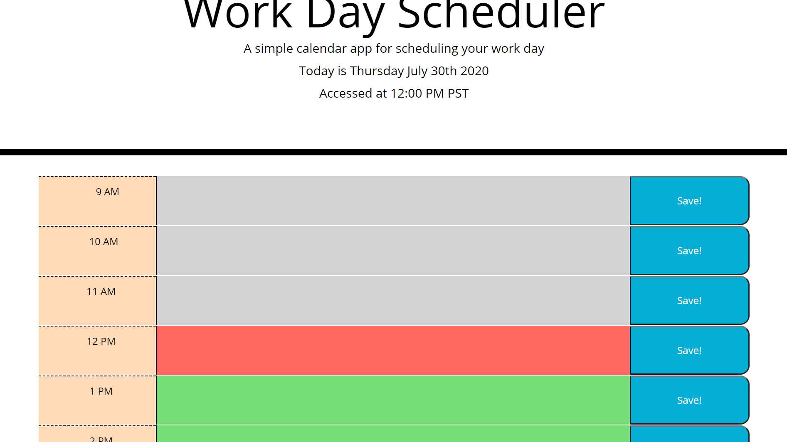

# Work Day Scheduler

### Made with HTML, CSS, and jQuery.

This application helps users organize their work day within the standard hours of **9:00 AM** to **5:00 PM**

Users can write down tasks for each hour and save their plans. Refreshing or exiting out will **_NOT_** clear **saved** tasks. This is done by using localStorage to hold user input. 

Lastly, by using moment.js, users can track previous, current, and upcoming tasks based on a color coding system and the current time.  

Grey-The time has passed
Red-Currently within the hour
Green-Upcoming
